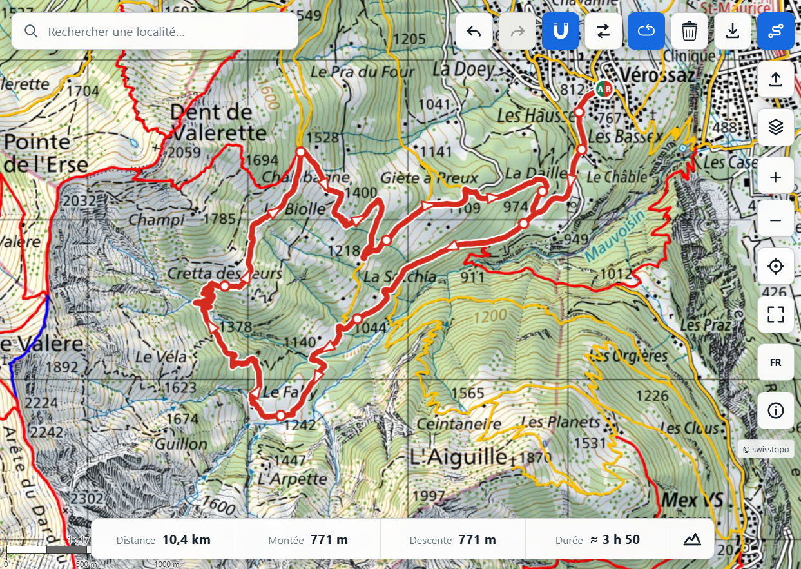

# Via Helvetica

[](https://github.com/egofree71/via-helvetica/actions/workflows/deploy.yml)
[](LICENSE)

Via Helvetica is a free, open-source web application for planning hiking
routes in Switzerland with official swisstopo maps and geodata. It stays
focused on one route at a time and runs entirely in the browser, so the public
application can remain usable without an account or a project-owned backend.

**Live application:** [viahelvetica.ch](https://viahelvetica.ch/)



## Table of contents

- [Features](#features)
- [Project principles](#project-principles)
- [Quick start](#quick-start)
- [Basic usage](#basic-usage)
- [Data sources](#data-sources)
- [Known limitations](#known-limitations)
- [Documentation](#documentation)
- [Regression tests](#regression-tests)
- [Production build and deployment](#production-build-and-deployment)
- [Contributing](#contributing)
- [License](#license)

## Features

| Area | Highlights |
|---|---|
| Map | Full-screen OpenLayers map in native Swiss LV95 (`EPSG:2056`), with official swisstopo color, grey, and aerial backgrounds, hiking trails, search, geolocation, scale, and fullscreen mode |
| Route planning | Editable ordered waypoints, start and finish markers, sparse direction arrows, optional swissTLM3D snapping in a dedicated routing Worker, undo, redo, reversal, loop closure, route deletion, and straight fallback segments when no routable path is found |
| Route information | Distance, ascent, descent, Swiss hiking-time estimate, and a collapsible elevation profile with pointer synchronisation between the chart and the map |
| Import and export | Read-only GPX loading with route statistics and elevation profile, plus named GPX export with simplified geometry and smoothed elevations when available |
| Safety | Official hiking-trail closures and detours, plus military shooting notices and danger zones with localized details |
| Public transport | Passenger-relevant stops, mode-specific symbols, next departures grouped by date, and links to the official SBB/CFF/FFS timetable |
| Interface | Compact floating controls, no permanent toolbar, French, German, Italian, and English translations, and a localized About dialog with project, support, professional profile, safety, and data-credit information |

## Project principles

Via Helvetica deliberately keeps route planning in the browser. Users do not
need to register, routes are not uploaded to a project-owned server, and static
hosting keeps recurring operating costs as low as possible. External official
services still receive the bounded requests required for maps and geodata.

The router is an interactive planning aid rather than an autonomous navigation
system. The official hiking portrayal remains visible on the map, and users can
add a closer waypoint whenever parallel paths or a complex junction make their
intent ambiguous.

## Quick start

Vite 8 requires Node.js 20.19 or later, or Node.js 22.12 or later. A recent
LTS release is recommended.

```bash
node --version
npm --version
npm install
npm run dev
```

Vite then displays the project address, usually:

```text
http://localhost:5173/
```

## Basic usage

### Choose maps and information layers

- Use the **Layers** button to choose the background map and enable or disable
  information overlays.
- The application uses official swisstopo portrayals for map backgrounds and
  hiking trails.

### Create and edit a route

- Activate route creation, then click or tap the map to place waypoints.
- Snapping is enabled by default and can be changed before the first waypoint.
  With snapping enabled, sections follow available swissTLM3D roads and paths.
  With snapping disabled, sections are created as straight lines.
- Drag an existing waypoint to move it, click it to delete it, or drag a route
  section to insert a new waypoint.
- Use the route controls to undo, redo, reverse, close or reopen a loop,
  delete, or export the current itinerary.
- Compact **A** and **B** markers identify the current start and finish.

### Import and export GPX

- Load a GPX file as the current purple, read-only itinerary.
- Imported GPX routes reuse embedded elevations when available, otherwise the
  profile is requested from GeoAdmin.
- Export the current editable route as a named GPX file with route statistics.
- Starting a new route replaces the imported itinerary.

### Inspect route and map information

- Distance, ascent, descent, Swiss hiking-time estimate, and the elevation
  profile are shown in the bottom summary.
- When the profile is open, moving over the route or the chart mirrors the same
  position in both directions.
- Outside route-creation mode, click visible closures, danger zones, or public
  transport stops to inspect their available information.
- Use the information button to open the localized About dialog with the
  project summary, support contact, source code, license, professional profile,
  and official data credits.

The application requests browser geolocation only after the location button is
pressed. Deployed geolocation requires HTTPS.

## Data sources

Via Helvetica uses official swisstopo backgrounds and swissTLM3D geodata,
official hiking-closure and military danger-zone layers, Federal Office of
Transport stop data, GeoAdmin services, and `transport.opendata.ch` departure
data.

- **swisstopo** provides the official Swiss maps and geodata.
- **swissTLM3D** is swisstopo's topographic landscape model and supplies the
  road-and-path network used for route snapping.
- **GeoAdmin** is the federal geodata platform used for bounded routing,
  elevation, and map-information requests.
- **LV95 / EPSG:2056** is the Swiss national projected coordinate system used
  internally by the map, routing graph, and editable geometries.

Walking-time estimates apply the slope-sensitive model published by Schweizer
Wanderwege in *Wanderzeitberechnung, Version 2020.2* (8 June 2020).

For the application-wide design, see the
[architecture document](docs/ARCHITECTURE.md). Detailed routing data sources,
cell loading, graph construction, snapping, A*, caching, and fallback behaviour
are documented in [Browser routing](docs/ROUTING.md).

## Known limitations

- Dynamic swissTLM3D routing is experimental and runs entirely in the browser.
- A route section falls back to a straight line when no routable path can be
  resolved.
- Closures and danger zones are informational and do not automatically change
  route calculation.
- Imported GPX routes are read-only and replace the current editable route.
- Routes are not persisted locally or remotely.
- External map, elevation, routing, and timetable services can be temporarily
  unavailable or incomplete.

## Documentation

- [Architecture](docs/ARCHITECTURE.md): product constraints, component
  boundaries, state model, main workflows, provider integration, performance,
  errors, testing, and deployment.
- [Browser routing](docs/ROUTING.md): bounded swissTLM3D loading, Worker
  protocol, cell and graph caches, hiking enrichment, snapping, A*, fallback
  semantics, tests, and validation scope.

## Regression tests

The focused Vitest suite covers immutable route transformations, route editing,
GPX parsing and export, route metrics, directional-arrow placement,
location-search provider normalization, passenger-stop filtering and viewport
loading, worker-client messaging, and the dynamic routing engine's corridor,
cache, cancellation cleanup, retry, hiking-enrichment fallback, and
straight-fallback behaviour.

Run the test suite with:

```bash
npm test
```

During development, use `npm run test:watch` to rerun affected tests after each
change. GitHub Actions runs the complete suite before building and deploying
the site.

## Production build and deployment

Build the production bundle with:

```bash
npm run build
```

Preview it locally with:

```bash
npm run preview
```

The repository includes a GitHub Actions workflow that builds and deploys the
application to GitHub Pages after a push to `main`. GitHub Pages must use
**GitHub Actions** as its deployment source. The production site is served from
the custom domain root at [viahelvetica.ch](https://viahelvetica.ch/), so Vite
uses `base: '/'` for generated assets.

## Contributing

Bug reports and focused improvement proposals are welcome through GitHub Issues.

Before opening a code contribution, please run:

```bash
npm test
npm run build
```

Keep user-facing text available in French, German, Italian, and English.
Application-wide design belongs in `docs/ARCHITECTURE.md`; routing-specific
design belongs in `docs/ROUTING.md`; `README.md` should stay concise and
user-oriented.

## License

The source code is released under the MIT License.

swisstopo and other external geodata remain subject to their own usage,
licensing, and attribution terms.
