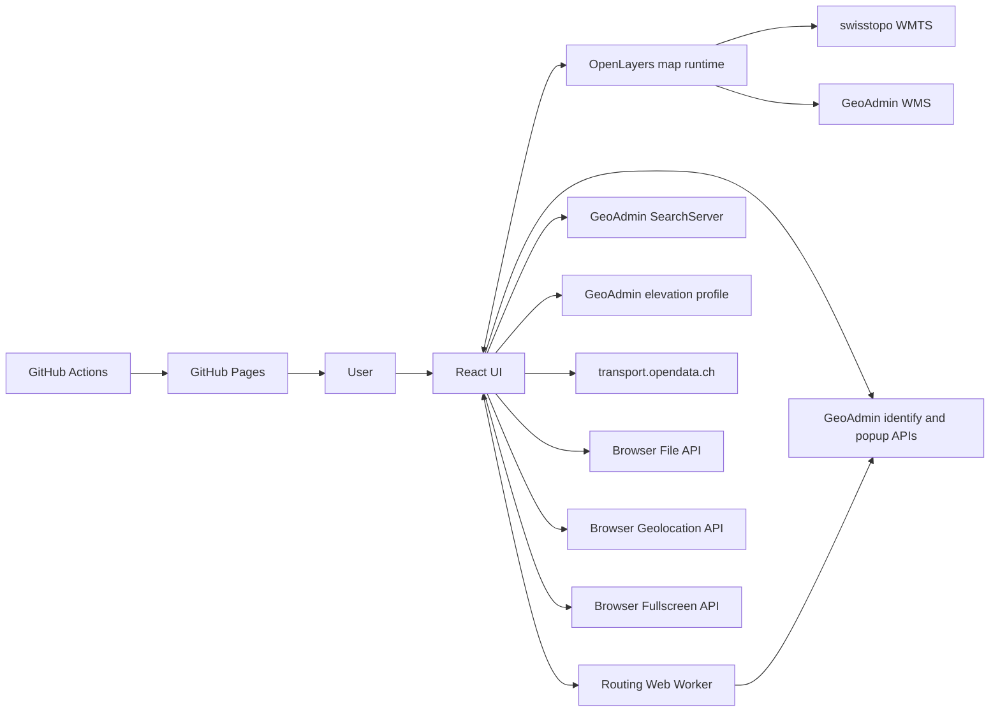
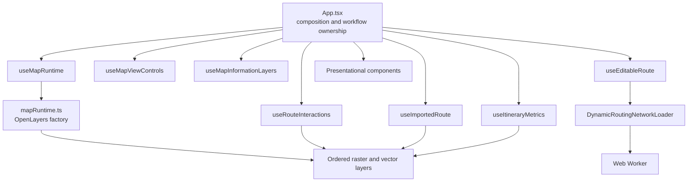
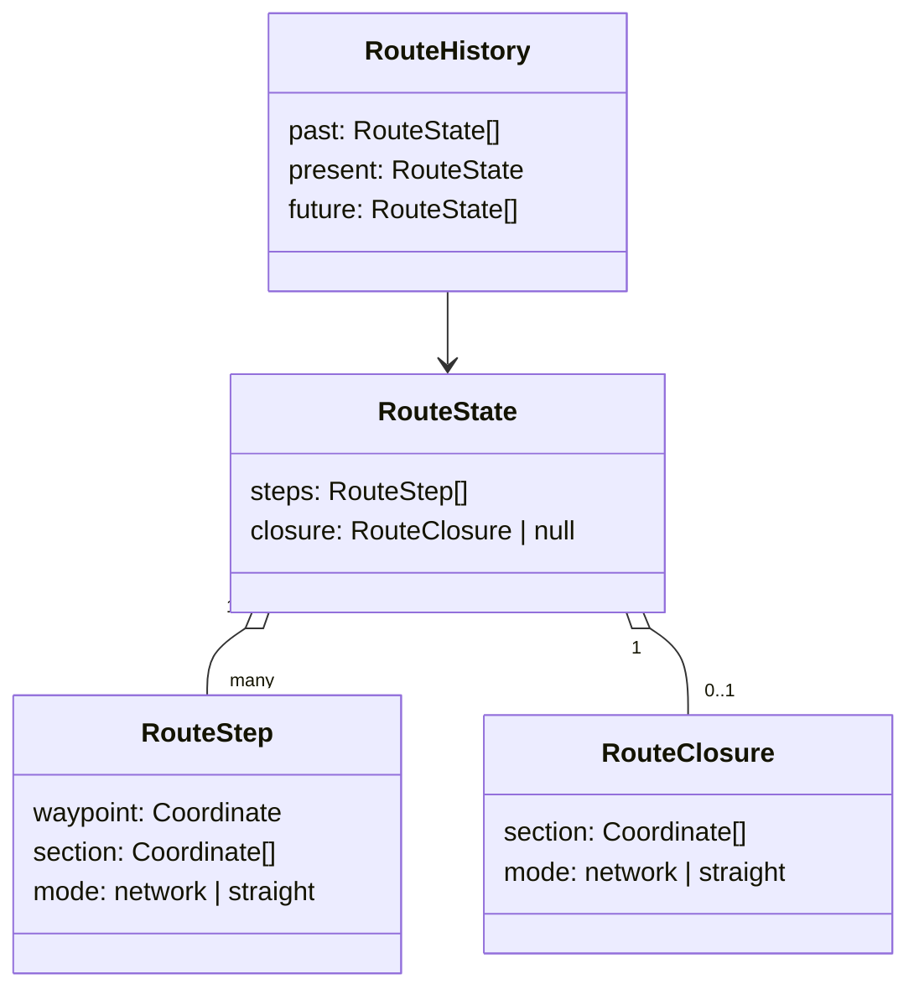
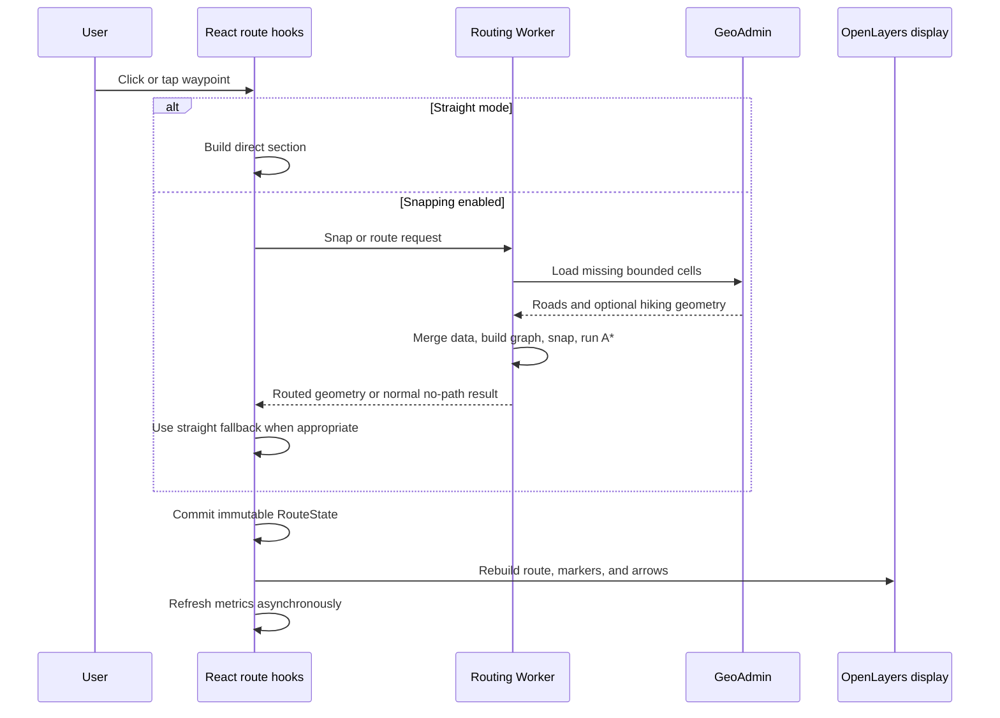
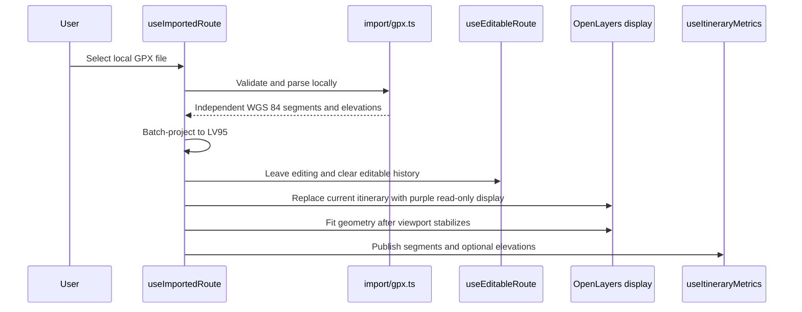

# Via Helvetica Architecture

## Executive summary

Via Helvetica is a map-centered, frontend-only application for planning one
hiking route at a time in Switzerland. React owns the user-interface state,
OpenLayers owns the imperative map runtime, and a dedicated Web Worker owns the
CPU- and network-intensive routing engine. The application is deployed as static
files on GitHub Pages and has no project-owned backend, user database, account
system, or remote route storage.

The map and internal geometry use the Swiss LV95 projection (`EPSG:2056`).
Official swisstopo backgrounds and geodata are loaded directly from federal
services. Editable routes are stored as immutable route states with exact
section geometry, which makes undo, redo, reversal, and loop operations
predictable. Imported GPX itineraries remain read-only and deliberately do not
enter editable-route history.

Routing is an experimental browser-side capability. It loads bounded
swissTLM3D cells around user-selected positions, builds a regional walkable
graph, snaps waypoints, and runs A* inside a Worker. Optional hiking geometry may
improve route preference, but provider degradation must not disable the required
road-and-path network. Full routing details live in [ROUTING.md](ROUTING.md).

Information overlays—hiking closures, military danger zones, and public-
transport stops—remain independent from route calculation. They inform the user
but do not silently alter routing costs or connectivity.

## 1. Product and architectural constraints

### 1.1 Product focus

The application intentionally remains narrow in scope:

- the map occupies almost the complete viewport;
- only one current itinerary is shown at a time;
- an editable route can be created, reshaped, reversed, closed, and exported;
- one external GPX route can replace it as a read-only itinerary;
- no route library, account system, or collaborative workspace is planned for
  the current product scope;
- the application is a planning aid, not a live-navigation or tracking tool.

The complete user-facing feature list belongs in the
[README](../README.md). This document concentrates on internal structure and
cross-module decisions.

### 1.2 Static, no-account operation

The production deployment contains only static assets. The browser contacts
external map and geodata providers directly and performs route calculation in a
Web Worker.

This constraint provides several benefits:

- no registration is required;
- routes are not uploaded to a project-owned service;
- there is no application database to operate;
- recurring infrastructure cost remains low;
- GitHub Pages can host the public application at
  [viahelvetica.ch](https://viahelvetica.ch/).

A future backend or preprocessed national graph is not forbidden, but it should
be introduced only after measured routing quality, provider limits, or real
usage justify the operational cost.

### 1.3 Official-data preference

The map, topographic network, and safety information rely primarily on official
Swiss sources. Provider-specific limitations are handled explicitly: optional
enrichment should degrade before core route editing becomes unavailable.

### 1.4 Map-centered interface

Permanent controls remain small and float over the map. Larger surfaces are
contextual and temporary:

- layer selector;
- route action strip;
- information popups;
- elevation profile;
- GPX export dialog;
- About dialog.

The responsive layout resolves collisions by moving small controls rather than
permanently reserving large strips of viewport space. The route summary stays on
the bottom edge, while the About control joins the right-side control stack when
horizontal space becomes tight. The metric scale is hidden at phone widths where
it would otherwise remain covered by the summary.

### 1.5 Explicit workflow boundaries

The application preserves three important boundaries:

1. **Editable route versus imported GPX** — imported geometry never becomes
   editable-route history.
2. **Information overlays versus routing** — closures, danger zones, and stops
   inform the user without changing the graph.
3. **React state versus OpenLayers runtime** — React coordinates workflows;
   OpenLayers objects remain behind focused imperative modules and hooks.

## 2. System context



### 2.1 External providers

| Provider or API | Purpose | Failure impact |
|---|---|---|
| swisstopo WMTS | Color, grey, aerial, and hiking-trail portrayals | Initial base-map failure is blocking; later isolated tile failures are not |
| GeoAdmin SearchServer | Official place search | Localized, retryable search failure |
| GeoAdmin identify | swissTLM3D routing data and map-feature inspection | Routing requests may fail; information overlays remain non-blocking |
| GeoAdmin HTML popup | Localized closure and military metadata | Popup reports a local error without changing route state |
| GeoAdmin WMS | Closure, detour, and military danger portrayals | Overlay failure does not block map use |
| GeoAdmin elevation profile | Elevation, ascent, descent, and walking-time samples | Distance remains available; altitude-dependent metrics become unavailable |
| Federal Office of Transport data | Passenger-stop geometry and attributes | Optional stop layer may be incomplete or unavailable |
| transport.opendata.ch | On-demand departure board | Stop remains visible even when departures fail |
| Browser APIs | Local GPX, geolocation, fullscreen | Capability-specific failure only |

### 2.2 Coordinate systems

The map runtime, rendered overlays, editable route, imported route, and routing
graph use Swiss LV95 (`EPSG:2056`). This gives route distances, snapping
thresholds, hit tolerances, and routing cells a shared metre-based coordinate
system and avoids reprojecting the official WMTS map in the browser.

WGS 84 (`EPSG:4326`) is used only at exchange boundaries:

- browser geolocation input;
- SearchServer results;
- GPX import;
- GPX export;
- geodesic calculations where required.

`src/map/projection.ts` registers LV95 through `proj4`, exposes the official
WMTS extent and resolution pyramid, and centralizes WGS 84/LV95 conversion.

## 3. Runtime composition

### 3.1 Component overview



### 3.2 Responsibility table

| Boundary | Main modules | Responsibility |
|---|---|---|
| Application composition | `src/App.tsx` | Connects focused hooks, resolves which temporary workflow owns the current itinerary, and owns modal state |
| Map lifetime | `src/map/mapRuntime.ts`, `src/map/useMapRuntime.ts` | Creates and disposes the single OpenLayers runtime; synchronizes startup and fullscreen state |
| Map controls | `src/map/useMapViewControls.ts` | Background choice, hiking-overlay visibility, zoom, fullscreen, and explicit geolocation |
| Information overlays | `src/map/useMapInformationLayers.ts` | Visibility, loading, inspection priority, popup state, selection, caching, and cancellation |
| Editable-route domain | `src/map/routeState.ts`, `src/map/useEditableRoute.ts` | Immutable route state, history, snap mode, serialized mutations, and route actions |
| Pointer interaction | `src/map/useRouteInteractions.ts`, `src/map/routePointerInteraction.ts` | Waypoint and section hit detection, drag previews, click/drag lifecycle, and semantic edit requests |
| Route presentation | `src/map/routeDisplay.ts`, `src/map/itineraryDirection.ts`, `src/map/itineraryEndpoints.ts` | Committed geometry, previews, direction arrows, and A/B markers |
| Imported GPX | `src/import/gpx.ts`, `src/map/useImportedRoute.ts`, `src/map/importedRoute.ts` | Local parsing, projection, read-only display, elevation reuse, and responsive view fitting |
| Metrics | `src/metrics/routeMetrics.ts`, `src/metrics/useItineraryMetrics.ts` | Distance, elevation request identity, ascent/descent, hiking time, profile samples, and map/profile synchronisation |
| Routing | `src/routing/` | Worker protocol, bounded provider loading, caches, graph construction, snapping, and A* |
| Search | `src/search/locationSearch.ts`, `src/components/LocationSearch.tsx` | Provider contract, session cache, result UI, keyboard navigation, and request cancellation |
| Localization | `src/i18n/` | Typed dictionaries, language persistence, Swiss locales, and document metadata |
| Static deployment | `.github/workflows/deploy.yml`, `vite.config.ts` | Test, build, Pages deployment, and root-relative production assets |

### 3.3 Application composition

`App.tsx` is intentionally a composition point rather than a second map engine.
It accesses one stable `MapRuntime` reference and coordinates independent
capabilities. Examples of cross-workflow coordination include:

- starting route creation clears an imported GPX and temporary search marker;
- a successful GPX import leaves route mode and clears editable history;
- opening the About dialog closes map-feature information;
- changing language clears temporary search state and provider selections;
- a valid import or route change becomes the single current itinerary for
  metrics.

Imperative OpenLayers sessions, provider requests, route history, and Worker
caches remain owned by focused hooks or modules rather than by `App.tsx`.

## 4. Core state model

### 4.1 Editable route

The editable route is represented by immutable `RouteState` snapshots.

A route contains ordered `RouteStep` values. Each step stores:

- the displayed waypoint;
- the exact geometry of the section arriving from the previous waypoint;
- the section mode: `network` or `straight`.

A closed route additionally stores one `RouteClosure` containing the exact final
section from the last waypoint back to the first. The closure does not create a
second visible start waypoint.



Snapshot history is deliberate. Undo and redo exchange complete stored states,
so exact geometry is restored without recalculation or another provider request.
Moving, inserting, or deleting a waypoint, reversing the route, and closing or
reopening the loop each form one undoable edit. A new edit clears the redo
stack. Complete deletion clears route history intentionally.

### 4.2 Imported GPX

An imported GPX is the current itinerary but not an editable route. It remains a
collection of independent projected segments so deliberate gaps between GPX
track segments are never connected artificially.

The import workflow owns:

- file-size validation;
- local XML parsing;
- stale-read protection;
- batched WGS 84 to LV95 projection;
- optional embedded elevations;
- read-only purple display;
- start/finish and direction markers;
- responsive `View.fit()` framing.

Starting a new editable route removes the imported itinerary without converting
it into route history.

### 4.3 Shared current-itinerary metrics

`useItineraryMetrics` receives either editable-route segments or imported-GPX
segments. It calculates distance immediately and then resolves altitude-
dependent values from embedded GPX elevations or the GeoAdmin elevation-profile
service.

Every asynchronous result is tied to the exact immutable segment-array identity
that requested it. Superseded requests are aborted, and stale responses cannot
update a newer itinerary.

The same profile samples support:

- ascent and descent;
- the Schweizer Wanderwege hiking-time estimate;
- the collapsible SVG profile;
- map-to-profile pointer lookup;
- profile-to-map pointer lookup.

## 5. Main workflows

### 5.1 Application startup

1. `main.tsx` mounts React and the language provider.
2. The language provider resolves the stored or browser language and updates
   ordinary document metadata.
3. `useMapRuntime` creates the single OpenLayers runtime after the map target is
   mounted.
4. `mapRuntime.ts` creates the LV95 view, explicit layer order, displays, and
   transient markers.
5. Focused hooks apply persisted background and overlay choices without
   recreating the map.
6. Optional providers begin work only when their layer, zoom, or user action
   requires it.

### 5.2 Editable-route creation



The first snapped waypoint loads only cells intersecting its maximum snapping
box. Later sections load a corridor between the existing endpoint and the new
selection. The routing engine first tries a narrow corridor and retries once
with a wider corridor when coverage or graph connectivity is insufficient.

Normal absence of coverage is different from provider failure. Missing nearby
network data may produce a free first waypoint or a straight incoming section,
while request, parsing, and safety-limit failures leave the existing route
unchanged and surface an actionable message.

See [ROUTING.md](ROUTING.md) for cell selection, caching, provider fallback,
graph construction, snapping, and A*.

### 5.3 Route reshaping

Pointer interaction stays separate from route calculation:

- waypoint or route-section hit detection begins a possible gesture;
- pointer movement renders temporary straight previews only;
- no routing request is performed during drag;
- release emits one semantic move, insertion, or deletion request;
- `routeEditing.ts` rebuilds only affected sections using the snap mode selected
  at release;
- the edit is committed as one immutable history entry;
- a failed recalculation restores the last committed display.

This separation keeps drag feedback responsive and prevents provider traffic for
every pointer movement.

### 5.4 Reversal, loop closure, and export

Route reversal reuses stored geometry rather than routing again. Open routes
reverse waypoint order and swap A/B endpoints. Closed routes rotate reversed
sections around the original start so the combined A/B marker stays at the same
physical point while travel direction changes.

Loop closure adds a dedicated final section and does not duplicate the start
waypoint. Closing and reopening are undoable snapshots.

GPX export:

- asks for a route name;
- simplifies each section independently so every waypoint remains exact;
- merges valid elevation samples without creating centimetre-scale duplicate
  points;
- converts LV95 geometry to WGS 84;
- writes a GPX 1.1 track with metadata bounds;
- starts a local browser download.

### 5.5 GPX import



A slower file read is ignored after a newer selection, route creation, or
unmount invalidates its session. Invalid imports leave the current itinerary
untouched.

### 5.6 Information-layer inspection

`useMapInformationLayers` owns one deterministic map-click pipeline outside
route mode:

1. already loaded public-transport stop vectors;
2. visible hiking closures;
3. visible military danger zones.

The stop layer uses validated structured data and a project-owned popup. Closure
and military details arrive as official HTML fragments, pass through a strict
sanitizer, and are rendered inside project-owned popup wrappers. Selected
military geometry is highlighted in a separate vector layer.

Visibility, zoom, language, and workflow changes abort obsolete requests and
clear stale selections. These overlays never mutate route geometry or routing
costs.

### 5.7 Search, geolocation, fullscreen, and About

Location search uses a bounded language-aware session cache and aborts
superseded uncached requests. Results are converted to plain text before React
renders them. Selecting a result creates a temporary marker that is cleared when
a higher-priority workflow takes ownership.

Geolocation is requested only after explicit user action. A valid WGS 84
position is converted to LV95, checked against the configured extent, displayed,
and centered. Continuous tracking is not used.

Fullscreen requests target the complete application root. A
`fullscreenchange` listener remains the source of truth and schedules
`map.updateSize()` after viewport changes.

The About dialog contains project context, experimental-routing guidance,
creator and support details, source and license links, professional profile, and
complete data credits. Its permanently visible map control provides direct
access to the centralized source references without occupying additional map
space.

## 6. Map and geodata integration

### 6.1 Native LV95 map

`src/map/config.ts` and `src/map/projection.ts` define the official LV95 WMTS
grid instead of using an XYZ/Web-Mercator shortcut. Base-map replacement keeps
the same view and overlays.

Selectable backgrounds include:

- official color national map;
- official grey national map, including its detailed source at close zoom;
- SWISSIMAGE aerial imagery.

The rendered hiking layer is a transparent official portrayal. It is independent
from the optional vector hiking geometry used to influence route costs.

### 6.2 Ordered layers

The runtime creates one explicit layer order. In broad terms:

1. selected raster background;
2. rendered hiking portrayal;
3. closure and military WMS overlays;
4. selection and public-transport vectors;
5. imported read-only itinerary;
6. editable route;
7. temporary search and user-location markers.

Route and endpoint readability takes priority over informational overlays.
Layer construction remains centralized so later features do not depend on
implicit insertion order.

### 6.3 Hiking closures and military danger zones

Both safety layers use official server-rendered WMS portrayals and localized
feature inspection. They are enabled independently and persist their visibility
choice.

The returned information is advisory. Via Helvetica does not automatically
avoid a visible closure or military zone because:

- provider records may require human interpretation;
- current applicability may depend on dates or local conditions;
- information-layer availability should not change graph connectivity silently.

### 6.4 Public-transport stops

The source dataset contains passenger stops as well as technical, retired, and
operational records. Via Helvetica therefore loads vector features and applies a
project-owned normalization layer rather than rendering the complete source
portrayal.

The stop workflow separates:

- provider loading and recursive subdivision;
- passenger-mode normalization and filtering;
- buffered viewport reuse;
- OpenLayers rendering and collision fan-out;
- selected-stop presentation;
- on-demand timetable loading.

A buffered request extent reduces repeated traffic during nearby pans. Zoom,
canvas-size, language, or visibility changes invalidate reuse. Timetable errors
do not remove the selected stop or its official SBB/CFF/FFS links.

## 7. Routing boundary

Routing is a specialized subsystem with its own Worker, protocol, provider
strategy, caches, graph model, and validation scope. `ARCHITECTURE.md` documents
only its relationship to the rest of the application.

The subsystem receives plain LV95 coordinates and returns structured-clone-safe
snap or route results. OpenLayers objects and React state never cross the Worker
boundary.

The required graph comes from official swissTLM3D roads and paths. Official
hiking geometry is optional enrichment used to prefer matching edges. If the
provider rejects the combined request, the Worker switches to roads-only loading
for the remaining session and emits one non-blocking notice.

For the complete design, tuning values, failure semantics, tests, and unresolved
validation work, see [ROUTING.md](ROUTING.md).

## 8. Performance and concurrency

### 8.1 Dedicated Worker

Network loading, graph construction, snapping, and A* stay outside the
React/OpenLayers thread. The map remains interactive while routing work runs.

### 8.2 Bounded work

Provider activity is constrained by:

- regular routing cells;
- corridor-based loading rather than national data loading;
- a maximum cell count per operation;
- bounded request and cell concurrency;
- recursive subdivision only when provider result limits require it;
- one wider-corridor retry rather than unbounded expansion.

### 8.3 Session caches

The routing Worker keeps:

- completed raw cells;
- reusable in-flight cell requests;
- a small least-recently-used cache of graphs for exact corridor cell sets.

Other focused caches include:

- language-specific location-search results;
- buffered public-transport viewport coverage;
- short stationboard responses;
- memoized directional-arrow geometry and styles;
- immutable elevation/profile samples.

Caches remain session-local and do not create persistence semantics.

### 8.4 Cancellation and stale-result guards

Every owner cancels work it supersedes:

- search effects abort older queries;
- information-layer changes abort identify and popup work;
- route mode changes abort active routing;
- new metrics abort older elevation requests;
- GPX sessions ignore obsolete file reads;
- Worker protocol messages support explicit cancellation.

Where platform work cannot stop immediately, request identity and immutable
references prevent obsolete completion from mutating current state.

### 8.5 Presentation performance

The route and elevation profile avoid unnecessary React churn:

- drag previews remain in OpenLayers rather than React state;
- direction arrows are resolution-aware and capped;
- cumulative geometry indexes support binary search;
- profile paths and graduations are memoized from immutable samples;
- pointer exploration updates only transient guide and marker state.

## 9. Error and fallback strategy

The general rule is to preserve the last usable state and localize failure to
the capability that caused it.

| Category | Strategy |
|---|---|
| Initial base map | Blocking startup error because the application is unusable without a map |
| Later raster tiles | Keep the already usable map; isolated failures are non-blocking |
| Search | Show a temporary localized error and allow immediate retry |
| Geolocation and fullscreen | Report capability-specific failure without changing route state |
| Information overlays | Keep map and route usable; abort stale work; show local popup or layer error |
| Routing coverage miss | Free first waypoint or straight section fallback; keep snap mode enabled |
| Routing provider or parsing error | Preserve current route; report an actionable error |
| Optional hiking enrichment | Switch to roads-only mode and continue required routing |
| Elevation profile | Keep distance; show unavailable altitude-dependent figures |
| GPX validation | Leave current itinerary untouched and report a localized error |
| Timetable | Keep selected stop and official external links visible |

Intentional cancellation is not reported as a user-visible error. There is no
application-wide retry loop or persistent project-owned logging service.

## 10. Module boundaries

### 10.1 Map runtime versus React

`mapRuntime.ts` creates one disposable imperative object that contains the map,
view, ordered layers, displays, and transient markers. React hooks apply changes
through that stable runtime instead of recreating OpenLayers objects on each
render.

### 10.2 Network contracts outside components

Provider parsing, validation, retry, and cancellation live in domain modules:

- `src/search/locationSearch.ts`;
- `src/closures/trailClosures.ts`;
- `src/dangers/shootingDangerZones.ts`;
- `src/transport/`;
- `src/metrics/routeMetrics.ts`;
- `src/routing/`.

Components receive typed data and controlled state rather than raw provider
responses.

### 10.3 Presentation versus domain state

Route history and immutable transformations remain independent from OpenLayers
features. Display modules rebuild features from committed domain state and own
only transient previews or styling metadata.

### 10.4 Compatibility facades

Small facades such as `src/map/route.ts` and
`src/transport/publicTransportStops.ts` preserve stable import surfaces while
implementation responsibilities remain in focused sibling modules. They should
stay small and should not become new orchestration layers.

### 10.5 Localization boundary

All user-facing strings belong to typed French, German, Italian, and English
dictionaries. Adding a translation key must fail compilation until every
supported language provides it. Provider identifiers and domain enums remain
language-neutral.

## 11. Testing and validation

### 11.1 Test strategy

Automated tests target stable domain contracts rather than browser canvas
appearance. They cover:

- immutable route transformations and history;
- affected-section reconstruction;
- route-pointer interaction primitives;
- GPX parsing, projection, metrics, and export;
- directional-arrow placement;
- location-search caching and normalization;
- public-transport filtering, viewport reuse, and API scale separation;
- routing-grid footprints;
- Worker request correlation, typed errors, cancellation, and disposal;
- dynamic routing engine caching, retry, fallback, and provider errors.

Provider calls are mocked. Regression tests must not depend on live external
services.

### 11.2 Manual validation

OpenLayers canvas rendering and complete pointer workflows remain manually
validated where a browser-level test would cost more than it protects. Important
manual checks include:

- mouse, pen, and touch route editing;
- responsive control collisions;
- GPX fitting on narrow viewports;
- map/profile pointer synchronisation;
- provider portrayals and official popup content;
- routing behaviour in contrasting geographic regions.

The routing subsystem remains experimental until topology and provider behaviour
are validated in varied Swiss environments, including dense cities, mountains,
bridges, tunnels, borders, and sparse coverage.

### 11.3 Required commands

Before an important commit:

```bash
npm test
npm run build
```

GitHub Actions executes the same regression suite before the production build
and Pages deployment.

## 12. Deployment and discovery

The workflow `.github/workflows/deploy.yml` runs on pushes to `main` and manual
dispatch. It:

1. checks out the repository;
2. installs locked dependencies with `npm ci`;
3. runs `npm test`;
4. runs `npm run build`;
5. uploads `dist/` as a Pages artifact;
6. deploys to the `github-pages` environment.

The custom domain serves the application at the root, so `vite.config.ts` uses:

```ts
base: '/'
```

GitHub Pages provides HTTPS, which is required for browser geolocation outside
`localhost`.

Static discovery assets include canonical, Open Graph, social-card, and
Schema.org metadata in `index.html`, plus `robots.txt` and `sitemap.xml` under
`public/`. The route-and-elevation screenshot is used consistently by Open Graph,
Twitter metadata, structured data, and the image sitemap. The React root is marked
`data-nosnippet` so transient interface text, including startup messages, is not
selected as a search-result excerpt or text-fragment deep link. These are
deployment concerns rather than runtime application services.

## 13. Code and documentation conventions

- Keep strict TypeScript enabled.
- Centralize provider identifiers, projections, and geographic constants.
- Keep internal geometry in EPSG:2056 and transform only at exchange boundaries.
- Keep network contracts outside React components.
- Keep every user-facing string in all four typed dictionaries.
- Sanitize provider HTML before rendering its limited semantic markup.
- Abort superseded asynchronous work and guard against stale completion.
- Preserve explicit OpenLayers layer ordering.
- Request privacy-sensitive browser capabilities only after explicit user input.
- Keep route history immutable and restore exact geometry without recalculation.
- Defer routing work during pointer dragging until release.
- Keep information overlays independent from route calculation.
- Give non-trivial modules a short business-context header.
- Comments should explain decisions, constraints, trade-offs, and safeguards—not
  paraphrase obvious code.
- Numeric tuning constants must state units and the effect of changing them.
- Use JSDoc for data contracts and complex public functions, including
  `@throws` where callers must handle failure.
- Explain sensitive algorithmic blocks such as A*, heaps, subdivision,
  concurrency, caches, and stale-result guards.
- Keep `README.md` concise and user-oriented.
- Update this document when module boundaries, primary workflows, deployment, or
  architectural constraints change.
- Update [ROUTING.md](ROUTING.md) when routing data sources, graph behaviour,
  tuning, cache policy, fallback semantics, or validation scope change.

## 14. Evolution criteria

Create a new abstraction when several modules genuinely repeat the same logic,
not merely because a future feature might need it.

Reconsider the current architecture when one or more of these conditions becomes
true:

- OpenLayers interactions become too numerous for focused hooks to coordinate;
- shared state no longer fits clearly behind `App.tsx` composition;
- multiple new providers require a common request policy;
- measured routing latency or reliability shows that browser-side bounded
  loading is no longer adequate;
- a national preprocessed graph would materially improve quality and can be
  operated sustainably;
- route persistence, collaboration, or accounts become explicit product goals;
- browser-level regression tests provide clear value over their maintenance
  cost.

New features should remain useful for Swiss hiking-route planning and should not
turn Via Helvetica into a general transport or geographic-information portal.

## 15. Key external specifications

- [OpenLayers documentation](https://openlayers.org/)
- [GeoAdmin feature identification](https://docs.geo.admin.ch/access-data/identify-features.html)
- [swissTLM3D landscape model](https://www.swisstopo.admin.ch/en/landscape-model-swisstlm3d)
- [GPX 1.1 schema](https://www.topografix.com/GPX/1/1/)
- [Vite documentation](https://vite.dev/)

Provider usage and attribution remain subject to the respective official terms.

## 16. Glossary

| Term | Meaning in Via Helvetica |
|---|---|
| A* | Shortest-path search used by the regional routing graph |
| GeoAdmin | Swiss federal geodata platform and APIs used by the application |
| GPX | XML exchange format used for route import and export |
| LV95 | Current Swiss national coordinate reference system |
| EPSG:2056 | EPSG identifier for LV95 |
| WGS 84 / EPSG:4326 | Longitude/latitude exchange coordinate system |
| WMTS | Tiled map service used for official raster backgrounds and hiking portrayal |
| WMS | Map-image service used for closure and military overlays |
| swissTLM3D | Official topographic landscape model supplying roads, paths, and optional hiking geometry |
| Worker | Browser execution context that isolates routing loading and computation from the map UI |
| Snapping | Projection of a user-selected waypoint onto a nearby routable network segment |
| Straight fallback | Direct section stored when normal coverage or connectivity cannot produce a network path |
| Current itinerary | Either the editable route or one imported read-only GPX, never both as independent active routes |
