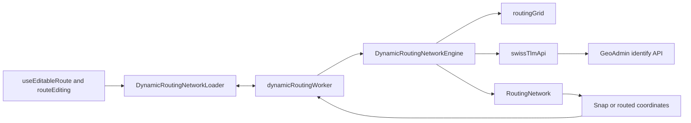

# Via Helvetica Browser Routing

## Executive summary

Via Helvetica calculates experimental hiking routes entirely in the browser.
A dedicated module Worker loads bounded official swissTLM3D data around
user-selected positions, caches raw cells, builds a regional walkable graph,
snaps waypoints, and runs A*. The main React/OpenLayers thread exchanges only
plain coordinate arrays, route results, cancellation messages, and serialized
errors with the Worker.

The required graph comes from the official
`ch.swisstopo.swisstlm3d-strassen` road-and-path layer. The official
`ch.swisstopo.swisstlm3d-wanderwege` layer is optional enrichment used to lower
the cost of matching graph edges. If that optional layer cannot be obtained, the
Worker continues in roads-only mode and reports one non-blocking session notice.

This subsystem is intentionally bounded and experimental. It does not download
a national dataset, does not operate a backend, and has not yet been validated
as a production-grade national router. Users can disable snapping or rely on a
straight fallback section when local coverage or graph connectivity is
insufficient.

## 1. Goals and non-goals

### 1.1 Goals

The routing subsystem should:

- keep route calculation available without a project-owned server;
- load only the geographic region needed for the current operation;
- preserve map responsiveness by running provider loading and graph work in a
  Worker;
- snap waypoints to nearby walkable roads and paths;
- prefer official hiking-trail sections when optional enrichment is available;
- avoid connecting vertically separated roads at bridges and tunnels when Z
  values are present;
- cache completed cells and recent corridor graphs for the browser session;
- distinguish normal missing coverage from provider or parsing errors;
- abort superseded work;
- degrade optional enrichment before required graph connectivity.

### 1.2 Non-goals

The current implementation does not provide:

- a downloaded or preprocessed national graph;
- a guaranteed production-grade national route service;
- live navigation or continuous user tracking;
- automatic avoidance of visible closure or military information layers;
- persistent routing caches between browser sessions;
- turn-by-turn instructions;
- route alternatives or multi-criteria profiles exposed to users;
- a general-purpose transport router.

## 2. Subsystem boundaries



### 2.1 Main-thread facade

`src/routing/dynamicRoutingNetwork.ts` provides the
`DynamicRoutingNetworkLoader` facade used by editable-route logic. It owns:

- lazy Worker creation;
- typed request identifiers;
- request/response correlation;
- `AbortSignal` to Worker-cancellation bridging;
- reconstruction of typed errors;
- retention and replay of non-blocking session notices;
- Worker restart after an unexpected failure;
- disposal of pending operations with the editable-route lifecycle.

It owns no routing cells, graph, or OpenLayers state.

### 2.2 Worker entry

`src/routing/dynamicRoutingWorker.ts` owns one session-scoped
`DynamicRoutingNetworkEngine`. It maps protocol operations to engine methods,
creates a per-request abort controller, serializes errors, and posts independent
session notices.

Synchronous graph construction may finish after a late cancellation, but it no
longer blocks the map thread and its obsolete response is ignored by the
request-correlation layer.

### 2.3 Worker-owned engine

`src/routing/dynamicRoutingEngine.ts` owns:

- completed raw-cell cache;
- reusable in-flight cell requests;
- exact-corridor graph LRU cache;
- cell loading concurrency;
- narrow and widened corridor attempts;
- feature merging;
- graph construction;
- snapping and A* invocation;
- the session-wide hiking-enrichment availability flag.

### 2.4 Graph implementation

`src/routing/networkRouter.ts` normalizes line segments into a walkable graph,
indexes segments for hiking matching and snapping, applies edge costs, and runs
A*.

### 2.5 Route-edit integration

`src/routing/routeEditing.ts` translates engine outcomes into immutable route
sections. It rebuilds only sections affected by waypoint addition, movement,
insertion, deletion, or loop changes. It decides when a normal no-path result
may become a straight fallback and when an error must leave the route unchanged.

## 3. Data sources and trust model

### 3.1 Required road-and-path data

The official GeoAdmin layer
`ch.swisstopo.swisstlm3d-strassen` supplies the geometries used to build graph
connectivity. Missing or truncated required roads can break routes, so unresolved
road truncation remains a hard error.

### 3.2 Optional hiking enrichment

The official layer `ch.swisstopo.swisstlm3d-wanderwege` supplies optional
hiking geometry. It does not become a second graph. Instead, graph road segments
that match official hiking geometry receive a lower routing cost.

The dataset and portrayal are official. However, the GeoAdmin layer table does
not advertise the same feature-tooltip behaviour as the road layer, so vector
retrieval through `identify` is treated as non-guaranteed enrichment.

### 3.3 Informational overlays are separate

The rendered hiking-trail WMTS overlay, ASTRA closure WMS, military-danger WMS,
and public-transport stops are independent from the routing graph. Their
visibility or inspection state does not alter route costs or connectivity.

This prevents temporary information-provider failure or ambiguous advisory data
from silently changing route calculation.

## 4. Spatial loading model

### 4.1 Native coordinates

All routing requests, cells, graph nodes, snapping distances, and corridor
calculations use LV95 (`EPSG:2056`) metres.

### 4.2 Regular routing cells

`src/routing/routingGrid.ts` divides LV95 space into regular cells.

| Constant | Value | Purpose |
|---|---:|---|
| Cell size | 2,400 m × 2,400 m | Stable unit for loading, caching, and corridor signatures |
| Maximum snap distance | 260 m | Limits attachment to unrelated roads |
| Initial route corridor radius | 1 cell | Loads the crossed cells plus one neighbour on every side |
| Wider retry radius | 2 cells | One bounded retry when the first graph lacks coverage or connectivity |
| Maximum cells per operation | 80 | Prevents one long section from causing excessive traffic or memory use |

Cell keys use stable integer column/row addresses. Extents are derived directly
from those indexes.

### 4.3 First-waypoint footprint

The first waypoint does not load a complete route corridor. It calculates the
closed square snapping box around the selected coordinate and loads only cells
whose extents intersect that box. This normally yields:

- one cell in the interior;
- two cells near an edge;
- four cells near a corner.

The point is then snapped against the resulting local graph. If no walkable
network exists or no segment falls within the maximum snap distance, the engine
returns `null` so the editor may place the point freely.

### 4.4 Route corridor

For later waypoints, an integer grid line walk identifies the cells crossed by
the direct segment between endpoints. Each crossed cell is expanded by the
corridor radius.

This corridor model avoids downloading the complete rectangular bounding box
between distant points. It is still a planning heuristic: a route that must make
a large detour outside both corridor widths can remain unresolved.

### 4.5 Narrow then wider retry

Each route operation:

1. builds or reuses the radius-1 corridor graph;
2. attempts snapping and A*;
3. if normal coverage or connectivity is insufficient, builds or reuses the
   radius-2 corridor graph;
4. returns `null` after the second normal miss.

Provider, parsing, cancellation, and safety-limit errors are not converted into
a wider normal retry unless explicitly handled by their owning layer.

## 5. GeoAdmin request strategy

### 5.1 Identify endpoint

`src/routing/swissTlmApi.ts` calls the documented GeoAdmin
`MapServer/identify` endpoint directly in `EPSG:2056`.

One logical request normally asks for both roads and hiking geometry. This avoids
doubling provider traffic when enrichment is accepted.

### 5.2 Request tiling

Each 2.4 km routing cell is initially divided into 1.2 km request tiles. A tile
that reaches the provider result cap is subdivided recursively.

| Constant | Value | Reason |
|---|---:|---|
| Initial request tile | 1,200 m | Keeps responses bounded inside a routing cell |
| Result limit | 200 features | GeoAdmin identify response cap used as the truncation signal |
| Maximum subdivision depth | 3 | Bounds recursive request growth |
| Tile-request concurrency | 4 | Protects the provider and browser while keeping loading interactive |
| Worker cell concurrency | 2 | Bounds simultaneous cell assembly at the engine level |

Road and hiking counts are evaluated independently.

- A road result still capped at the minimum tile size is a hard error because
  missing roads may break graph connectivity.
- A hiking result still capped at the minimum tile size is accepted as partial
  enrichment because missing hiking matches affect preference, not connectivity.

Empty road cells are valid near borders, lakes, and areas outside swissTLM3D
coverage.

### 5.3 Timeout and retry

Each identify attempt has:

- a 15-second timeout;
- one internal retry for network failure, timeout, HTTP 408, 429, 502, 503, or
  504;
- a fallback delay of 400–1,000 ms with jitter;
- support for a short `Retry-After` value up to 15 seconds;
- immediate caller cancellation during fetch or retry delay.

A longer `Retry-After` is surfaced rather than shortened, because retrying too
early would create another likely failure.

Progress counts logical tiles, not internal attempts.

### 5.4 Stable feature identity

Features crossing request or cell boundaries may appear several times. Provider
IDs are used where available. A coordinate-based fallback ID uses bounded
precision when necessary. Features are deduplicated before graph construction.

## 6. Hiking-enrichment fallback

### 6.1 Combined request rejection

If GeoAdmin rejects the combined road-and-hiking layer request with a
non-retryable HTTP response, the same tile is requested again with the required
road layer only.

Network failures, timeouts, rate limiting, and transient server statuses keep
their normal retry behaviour and are not misclassified as a layer-specific
rejection.

### 6.2 Session-wide roads-only mode

The first confirmed layer-specific rejection disables new hiking requests for
the remaining lifetime of the routing Worker. Concurrent and later cells share
the same engine-owned flag. Already cached hiking geometry remains valid.

This one-way transition prevents every new waypoint from repeating a known
unsupported request.

The Worker emits one structured session notice. The main-thread facade retains
it and replays it to a later subscriber when necessary, which protects the
notice across React Strict Mode development setup/cleanup cycles.

### 6.3 Local manual test switch

`src/routing/routingConfig.ts` exposes a narrow development-only switch:

```ts
LOCAL_ROUTING_DEVELOPMENT_CONFIG.useHikingEnrichment
```

When set to `false` on `localhost`, `127.0.0.1`, or IPv6 loopback, the Worker
starts in roads-only mode and emits the same normal notice when the first routing
operation begins.

Deployed hostnames always resolve to `true`, even if the local source value is
left disabled accidentally. The switch does not affect the rendered hiking map
overlay.

## 7. Worker protocol and lifecycle

`src/routing/dynamicRoutingProtocol.ts` defines structured-clone-safe messages
for:

- snap requests;
- route requests;
- cancellation;
- successful responses;
- serialized failures;
- non-blocking session notices.

`RoutingAreaTooLargeError` is reconstructed explicitly on the main thread so
`instanceof` handling remains meaningful across the Worker boundary.

One `DynamicRoutingNetworkLoader` belongs to the editable-route hook lifecycle.
Disposal rejects pending work and terminates the Worker. A later route-editing
session may create a fresh Worker and fresh session caches.

## 8. Cache design

### 8.1 Completed raw cells

Completed cells remain in Worker memory for the page session. Reusing a cell
avoids another GeoAdmin request when later route edits revisit the same area.

### 8.2 In-flight cell sharing

Concurrent consumers share a pending cell promise when its owning signal is
still valid. A cancelled pending request is removed so a later operation can
retry rather than inheriting an aborted promise.

### 8.3 Graph LRU

Graphs are cached by an exact sorted signature of their corridor cell set.

- cache limit: 8 `RoutingNetwork` instances;
- a hit is promoted to most-recently-used position;
- the least-recently-used graph is evicted after the limit;
- raw cells remain available even when a derived graph is evicted.

Exact signatures avoid reusing a graph whose geographic coverage differs from
the requested corridor.

### 8.4 Feature merging

Before graph construction, roads and hiking features from all contributing
cells are merged by stable feature ID. This prevents duplicate edges when a
geometry crosses cell boundaries.

## 9. Graph construction

### 9.1 Vertices and edges

Each pair of consecutive swissTLM3D vertices becomes a candidate network
segment. Segments shorter than the configured minimum are discarded. Clearly
non-walkable object types are excluded.

Duplicate opposite or overlapping candidate segments are normalized so the
graph does not retain a worse duplicate edge between the same node pair.

### 9.2 Node identity and 3D separation

Graph endpoints are quantized to absorb small coordinate differences returned
by adjacent provider geometries.

| Precision | Value | Purpose |
|---|---:|---|
| Horizontal node precision | 0.5 m | Merge nearly identical XY endpoints without excessive graph fragmentation |
| Vertical node precision | 2 m | Keep crossings on different heights separate when Z values are available |

Including elevation in the node key prevents a bridge and the road beneath it
from being connected merely because their XY coordinates cross.

This protection depends on available source Z values and does not guarantee
perfect topology in every bridge or tunnel case.

### 9.3 Spatial indexes

A regular 250 m spatial grid indexes:

- hiking line segments used for enrichment matching;
- routable segments used for waypoint snapping.

The index reduces repeated full-network scans during graph construction and
snap lookup.

### 9.4 Road cost factors

Walkable road segments receive a multiplicative cost factor derived from
available swissTLM3D attributes such as:

- object type;
- width or road importance;
- surface;
- traffic relevance;
- access restriction;
- official hiking match.

A factor of `Infinity` excludes a non-walkable segment. Lower positive factors
make a segment more attractive to A*. The minimum configured cost factor is
`0.45`; the A* heuristic uses this lower bound to remain admissible.

The exact attribute policy belongs in `networkRouter.ts` and its tests because
it may evolve as swissTLM3D attributes are validated in more regions.

## 10. Hiking-segment matching

Hiking geometry is not assumed to share exact vertices with the road network.
A road segment is evaluated against nearby indexed hiking segments using:

- maximum matching distance: 8 m;
- direction compatibility with minimum cosine `0.7`;
- samples at 25%, 50%, and 75% of the road segment;
- at least two matching samples to classify the road segment as hiking
  enrichment.

Sampling several positions avoids marking a road as a hiking trail merely
because the two lines cross once. Direction checks reduce false matches between
nearby parallel or perpendicular geometries.

A missing match never removes graph connectivity; it only leaves the normal road
cost unchanged.

## 11. Snapping

### 11.1 Snap search

The graph segment index queries candidates inside the 260 m maximum distance.
Each user coordinate is projected onto candidate segments, and the closest valid
projection is selected.

The snap result contains:

- projected coordinate, including interpolated Z when available;
- distance from the user selection;
- matched network segment;
- fractional position from 0 to 1 along that segment.

### 11.2 Route endpoints on segments

A snapped route may begin or end inside a segment. The router creates candidate
costs to both segment endpoints and later reconstructs exact connector geometry
from the projected snap positions.

If both endpoints snap to the same segment, a direct same-segment path is tested
before the full graph search.

### 11.3 Normal snap miss

A snap operation returns `null` when:

- the loaded cells contain no walkable graph;
- no segment lies inside the maximum snapping distance.

This is a normal coverage result, not a provider error.

## 12. A* path calculation

### 12.1 Search state

The router uses a binary min-heap ordered by:

```text
actual accumulated cost + straight-line distance to goal × MIN_COST_FACTOR
```

Because `MIN_COST_FACTOR` is no greater than any configured edge factor, the
heuristic remains a lower bound on remaining cost and therefore admissible.

The search tracks:

- best known distance to each graph node;
- previous node for reconstruction;
- best complete destination cost discovered so far.

Queue entries whose priority cannot improve the best complete route are skipped.
Stale heap entries whose distance is worse than the stored best distance are
also ignored.

### 12.2 Destination candidates

The end snap can connect through either endpoint of its matched segment. When the
search reaches one of those graph nodes, the final connector cost is evaluated.
The best complete destination cost allows the search to stop exploring branches
that cannot produce a better route.

### 12.3 Reconstruction

The selected graph-node chain is reconstructed backwards through the previous-
node map, then converted to ordered coordinates. Exact snapped start and end
connectors are added while avoiding duplicate adjacent coordinates.

The result contains only structured-clone-safe coordinate arrays and a network
mode indicator.

## 13. Route-edit semantics and straight fallback

### 13.1 Addition

With snapping disabled, a new section is an exact direct line.

With snapping enabled:

- the first waypoint is snapped locally when possible;
- later waypoints request a routed section;
- a normal no-path result becomes a straight section;
- the global snap option remains enabled for the next operation.

### 13.2 Movement

Moving a waypoint rebuilds only its incoming and outgoing sections. In a closed
route, moving the first or last waypoint also rebuilds the closure where
required.

### 13.3 Insertion

Dragging a stored section inserts one waypoint and replaces that section with
two sections. Each half independently uses the current snap mode and may
independently fall back to a straight line after a normal coverage miss.

### 13.4 Deletion

Deleting an intermediate waypoint reconnects its neighbours using the current
snap mode. Endpoint deletion in a closed route rebuilds the remaining loop.
Unrelated sections retain their exact stored geometry.

### 13.5 Error versus fallback

A straight fallback is allowed for normal absence of coverage or connectivity.
It is not used to hide:

- network transport failure;
- response parsing failure;
- unresolved required-road truncation;
- routing-area safety-limit overflow;
- unexpected Worker failure.

Those errors leave the committed route unchanged and are surfaced to the user.

## 14. Cancellation and stale results

Each main-thread operation owns an `AbortSignal`. Cancellation is forwarded to
the Worker and then to provider requests and retry delays.

Cancellation occurs when:

- route mode is left;
- a newer serialized route mutation supersedes active work;
- the application unmounts;
- the routing facade is disposed.

Completed cells remain useful when they finished before cancellation. A pending
cell whose request was aborted is removed and can be requested again later.

Late Worker responses are correlated by request ID and ignored after the
request has been cancelled or replaced.

## 15. Failure model

| Outcome | Meaning | Editor behaviour |
|---|---|---|
| `null` from local snap | Empty graph or no nearby segment | Place first waypoint freely |
| `null` after both corridors | Normal missing coverage or connectivity | Store that section as straight |
| Hiking enrichment unavailable | Optional provider capability rejected | Continue roads-only and show one notice |
| `RoutingAreaTooLargeError` | Cell safety limit exceeded | Preserve route and ask for intermediate waypoints |
| Required-road truncation | Provider cap remains after maximum subdivision | Preserve route and report error |
| Timeout or transient failure after retry | Provider unavailable | Preserve route and report error |
| Intentional cancellation | Operation replaced or editing ended | No user-visible error |
| Worker crash | Unexpected subsystem failure | Reject pending requests and recreate lazily later |

## 16. Tests

### 16.1 Pure grid tests

`routingGrid` behaviour is tested without importing Worker or graph code:

- one/two/four-cell first-click footprints;
- corridor cell selection;
- stable LV95 extents.

### 16.2 Provider tests

`swissTlmApi` tests protect:

- request timeout;
- one-shot transient retry;
- `Retry-After` handling;
- road-only retry after combined-layer rejection;
- road versus hiking truncation semantics;
- cancellation distinction;
- response normalization and deduplication.

Live GeoAdmin requests are not used by the regression suite.

### 16.3 Worker-client tests

The main-thread facade tests cover:

- request correlation;
- typed error reconstruction;
- cancellation messages;
- ignored late responses;
- notice retention;
- disposal and unexpected Worker failure.

### 16.4 Engine tests

The engine uses mocked provider loaders and graph doubles to protect:

- narrow-to-wider corridor retry;
- completed cell reuse;
- in-flight cell reuse;
- cleanup and retry after an aborted cell request;
- true least-recently-used graph eviction;
- cache and area limits;
- session-wide roads-only transition;
- provider-error propagation;
- normal straight-fallback signalling.

### 16.5 Graph tests

`networkRouter` tests cover structured-clone-safe results and focused graph
behaviour. Algorithm constants and non-obvious heuristics remain documented in
code and should receive regression tests when their policy changes.

### 16.6 Manual geographic validation

Automated tests cannot prove the quality of real swissTLM3D topology. Manual
validation should include contrasting regions:

- dense urban street networks;
- mountain paths and switchbacks;
- parallel hiking and road geometries;
- bridges, tunnels, and vertically separated crossings;
- lakes and empty cells;
- border areas;
- long detours that challenge corridor width;
- regions where optional hiking identify is rejected or incomplete.

Results should guide tuning before considering a national preprocessed graph or
backend.

## 17. Performance limits and trade-offs

The current values intentionally favour bounded public-provider use and browser
responsiveness over exhaustive national routing.

Trade-offs include:

- larger cells improve graph continuity but increase response size and graph
  construction cost;
- wider corridors find larger detours but increase provider traffic and memory;
- larger snap distance makes selection easier but risks unrelated roads;
- more request concurrency reduces latency but increases provider load;
- larger graph caches improve local editing but retain more memory;
- aggressive hiking matching improves trail preference but increases false
  positives;
- stronger road penalties influence quality but can produce surprising detours.

Tuning must be validated geographically rather than optimized against one
example route.

## 18. Possible evolution

### 18.1 Near-term validation

Further work should focus on evidence:

- add topology fixtures for real bridge, tunnel, and junction cases;
- compare routes in urban, rural, alpine, and border regions;
- measure provider request volume and latency;
- inspect roads-only versus enriched route quality;
- document reproducible problematic corridors.

### 18.2 Static preprocessed data

A possible intermediate architecture is:

```text
official GeoPackage
        ↓
local script or GitHub Actions preparation
        ↓
compact vector cells
        ↓
GitHub Pages static storage
        ↓
Worker loads cells on demand
```

This could remove dependence on non-guaranteed hiking-vector identify behaviour
while preserving frontend-only deployment. It would add data-preparation,
versioning, storage, and update responsibilities and therefore requires a
separate architectural decision.

### 18.3 National graph or backend

A national preprocessed graph or backend becomes reasonable only when measured
usage or routing quality shows that bounded browser loading cannot meet the
product goal. Such a change would require decisions about:

- data update cadence;
- hosting and bandwidth cost;
- graph partitioning;
- API design and abuse protection;
- monitoring and operational ownership;
- privacy and route-request retention;
- offline or static alternatives.

The existing `DynamicRoutingNetworkLoader` boundary should make future routing
implementations replaceable without coupling React components to graph details.

## 19. Maintenance rules

Update this document when any of the following changes:

- routing provider or layer identifiers;
- cell, corridor, subdivision, timeout, retry, or concurrency policy;
- Worker protocol;
- graph-node identity or walkability rules;
- road cost or hiking-match policy;
- snap semantics;
- cache limits or eviction policy;
- distinction between fallback and error;
- geographic validation scope;
- decision to introduce preprocessed data or a backend.

Keep tuning constants documented in code with their unit and trade-off. Keep
algorithmic safeguards such as A*, heaps, subdivision, caching, and stale-result
handling explained near the implementation. This document describes the
subsystem design; code comments remain the closest source for exact formulas.
